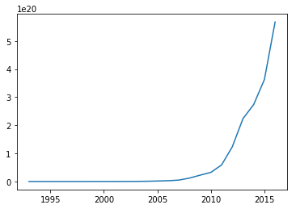
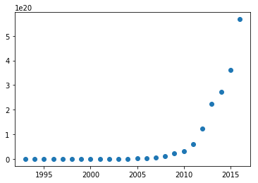
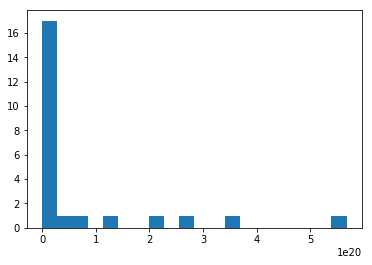
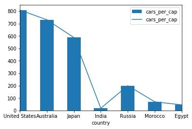

# PYTHON PROGRAMMING FOR DATA ANALYSIS

From basics to more sophisticated command for data visualisation
0. Requirement
1. Basics python command
1. Lists
2. Numpy
3. Matplotlib
3. Dictionnaires
1. Pandas lib
1. Importing data


---
## Requirement


```python
import numpy as np
import xlrd #With pandas
import matplotlib.pyplot as plt
import pandas as pd
```

## Basics


```python
#Exponentiation
print(4 ** 3)
```

    64


```python
#Types and converstion
mInt = 6
mFloat = .4
mString = "Hey"
mConversion = str(mFloat)
print (mInt, mFloat, mString, type(mConversion))
```

    6 0.4 Hey <class 'str'>


---
## Lists 


```python
a = "is"
b = "nice"
my_list = [["my", "nested", "list"], a, b]
print (my_list)
```

    [['my', 'nested', 'list'], 'is', 'nice']


```python
print (my_list[-1],  " == ",  my_list [2])
```

    nice  ==  nice


```python
#Slicing and dicing
x = ["0", "1", "2", "3"]
print (x[1:3]) #end border is exclusif
print (x[:2])
```

    ['1', '2']
    ['0', '1']


```python
x = [["a", "b", "c"],
     ["d", "e", "f"],
     ["g", "h", "i"]]
print(x[2][0])
print(x[2][:2])#Intersection of both index
```

    g
    ['g', 'h']


```python
x = x + [["j", "k", "l"]] #add a sublist with double [[]]
print (x)
```

    [['a', 'b', 'c'], ['d', 'e', 'f'], ['g', 'h', 'i'], ['j', 'k', 'l']]


```python
# Create areas_copy
X_pointer = x #Point to the same list (memory adress)
y = list(x)   #Y is an other list
del(x[1])
print (y)
```

    [['a', 'b', 'c'], ['d', 'e', 'f'], ['g', 'h', 'i'], ['j', 'k', 'l']]


```python
z = [11.25, 18.0, 20.0]
# Sort full in descending order: full_sorted
full_sorted = sorted (z, reverse=True)
# Print out full_sorted
print(full_sorted)
```

    [20.0, 18.0, 11.25]


```python
#Search index
print(z.index(20.0))
# Print out how often 14.5 appears in areas
print (z.count(18.0))
```

    2
    1


### Loop


```python
# house list of lists
house = [["hallway", 11.25], 
         ["kitchen", 18.0], 
         ["living room", 20.0], 
         ["bedroom", 10.75], 
         ["bathroom", 9.50]]
         
# Build a for loop from scratch
for x,y in house:
    print("the " + str(x) + " is " + str(y) +  " sqm")
```

    the hallway is 11.25 sqm
    the kitchen is 18.0 sqm
    the living room is 20.0 sqm
    the bedroom is 10.75 sqm
    the bathroom is 9.5 sqm


### Enumerate


```python
#to get the index 
areas = [11.25, 18.0, 20.0, 10.75, 9.50]

# Code the for loop
for index, area in enumerate(areas) :
    print("room " + str(index) + ": " + str(area))
```

---
##  Numpy
the fundamental package for scientific computing with Python
- The standard for storing numerical data
- Used by other package


```python
# Import the numpy package as np
import numpy as np
```


```python
# Create list baseball
baseball = [180, 215, 210, 210, 188, 176, 209, 200]
# Create a Numpy array from baseball: np_baseball
np_baseball = np.array(baseball)
print (baseball)
print (np_baseball)
```

    [180, 215, 210, 210, 188, 176, 209, 200]
    [180 215 210 210 188 176 209 200]


```python
#Perform operation on all datas
print (np_baseball * 10)
```

    [1800 2150 2100 2100 1880 1760 2090 2000]


```python
#Perform condition
print (np_baseball [np_baseball < 200]) #the conditition is creating an boolean array
#So we can get indexes from one np.array to slect value in a second one

#Compare two array one by one element
my_house = np.array([18.0, 20.0, 10.75, 9.50])
your_house = np.array([14.0, 24.0, 14.25, 9.0])
print(my_house < your_house)

# my_house greater than 18.5 or smaller than 10
print(np.logical_or(my_house > 18.5, 
            my_house < 10))
```


    ---------------------------------------------------------------------------

    NameError                                 Traceback (most recent call last)

    <ipython-input-2-308fbb54262b> in <module>()
          1 #Perform condition
    ----> 2 print (np_baseball [np_baseball < 200]) #the conditition is creating an boolean array
          3 #So we can get indexes from one np.array to slect value in a second one
          4 
          5 #Compare two array one by one element


    NameError: name 'np_baseball' is not defined


### Importing data command


```python
#Load from txt file
digits = np.loadtxt(file, 
                    delimiter=',',
                    skiprows=1         #If the first row is a header
                   )
#plt.scatter(data_float[:, 0], data_float[:, 1]) # premiere colonne indice, seconde les valeurs
```

- Importing data array with differents type: create an ndarray of ndarray
    - np.genfromtxt
    - np.recfromcsv() same as genfromtxt with defaults delimiter=',' and names=True, in addition to dtype=None!


```python
data = np.genfromtxt('titanic.csv', delimiter=',', names=True, dtype=None) #names means the first row is the label
```

### 2d Numpy Array


```python
# Create baseball, a list of lists
baseball = [[180, 78.4],
            [215, 102.7],
            [210, 98.5],
            [188, 75.2]]
# Create a 2D Numpy array from baseball: np_baseball
np_baseball = np.array (baseball)
# Print out the shape of np_baseball
print (np_baseball.shape)
```

    (4, 2)


```python
# Print out the 4th row of np_baseball
print (np_baseball[3,:])
# Select the entire second column of np_baseball: np_weight
print (np_baseball[:,1])
```

    [ 188.    75.2]
    [  78.4  102.7   98.5   75.2]


```python
#Appllying a filter on an array
conversion = np.array([10, 1000])
# Print out product of np_baseball and conversion
print ( np_baseball * conversion)
```

    [[   1800.   78400.]
     [   2150.  102700.]
     [   2100.   98500.]
     [   1880.   75200.]]


### Some statistics tricks


```python
# Print out the mean of height
print( np.mean(np_baseball[:,0]))
# Print out the median of weight
print( np.median(np_baseball[:,1]))
```

    198.25
    88.45


```python
#Are these columns correlated ?
print(np.corrcoef(np_baseball[:,0],np_baseball[:,1]))
```

    [[ 1.          0.95865738]
     [ 0.95865738  1.        ]]


### Loop 1d and 2d


```python
# For loop over np_height
np_height = np.array ([180, 215, 210, 210, 188, 176, 209, 200])
for l in np_height:
    print (str(l) + " inches")

# Create a 2D Numpy array from baseball: np_baseball
baseball = [[180, 78.4],
            [215, 102.7],
            [210, 98.5],
            [188, 75.2]]
np_baseball = np.array (baseball)
    
# For loop over np_baseball: every elements one by line
for l in np.nditer(np_baseball):
    print (l)
```

    180 inches
    215 inches
    210 inches
    210 inches
    188 inches
    176 inches
    209 inches
    200 inches
    180.0
    78.4
    215.0
    102.7
    210.0
    98.5
    188.0
    75.2


```python
np.random.seed(123)
# Use randint() to simulate a dice
print(np.random.randint(1, 7))
```

    6


---
##  Matplotlib 


```python
import matplotlib.pyplot as plt
import numpy as np
x = np.array ( [1993, 1994, 1995, 1996, 1997, 1998, 1999, 2000, 2001, 2002, 2003, 2004, 2005, 2006, 2007, 2008, 2009, 2010, 2011, 2012, 2013, 2014, 2015, 2016])
y = np.array (  [0.10000000000000001, 0.40000000000000002, 1.0999999999999999, 2.4000000000000008, 7.9999999999999876, 14.499999999999979, 30.700000000000152, 64.600000000000421, 109.19999999999807, 218.9999999999977, 371.79999999999768, 811.90000000000293, 1695.6000000000022, 2789.7999999999979, 4949.3999999999842, 12152.599999999993, 22639.799999999974, 32434.200000000077, 58928.000000000015, 123415.90000000002, 223653.8000000001, 273763.70000000042, 362651.79999999981, 567354.00000000012])
y = y * 1E15
```

### Type of plot


```python
plt.plot(x,y)        #Plot line
plt.show()
plt.scatter(x,y)     #Plotpoint
plt.show()
plt.hist(y, bins=20)  #Histogram with 20 rectangles
plt.show()
```











### Options


```python
col =  {
    '1993':'red',
    'Europe':'green',
    '2014':'blue',
    '2015':'yellow',
    'Oceania':'black'
}

plt.scatter(x, y,
           alpha=.8,       #Oppacity
           s=(x-1990) **2  #Size of bubble: can be a np_array (no sens in this example)
           #c=col          #Change the bubble's color depending on the value (TODO)
           )
plt.yscale('log')   #Log scale on y
plt.xlabel("Years")
plt.ylabel("Computing power FLOP/S")
plt.title ("Analysis of Top500 performance \n(Sum of the 500 supercomputer's performance)")
plt.grid(True)

#Annotation
plt.text(2005, 1E17, 'These bubbles have no sense!')
#Arrow
texteX1 = 2000
texteY1 = 1E15
flecheX1 = 2000
flecheY1 = 1E16*4

plt.annotate('Nice bubble here',
             xy=(flecheX1, flecheY1), xycoords='data',
             xytext=(texteX1, texteY1), textcoords='data',
             arrowprops=dict(arrowstyle="->",
                            linewidth = 5.,
                            color = 'red'),
            )

#Set custome min and max value for x and y axis.
x1,x2,y1,y2 = plt.axis()
plt.axis((1990,x2,y1,y2))

# Definition of tick_val and tick_lab
tick_val = [1E12,1E15,1E18, 1E21]
tick_lab = ['GigaFlops','PetaFlops','ExaFlops', 'ZettaFlops']
plt.yticks(tick_val, tick_lab)
plt.show()
```


---
##  Dictionaries
Data structure key:value


```python
# Definition of dictionary
europe = {'spain':'madrid', 'france':'paris', 'germany':'berlin', 'norway':'oslo' }

# Add italy to europe
europe['italy'] = 'rome'

# Remove australia
del europe['germany']

# Print out the keys in europe
print(europe.keys())

# Print out value that belongs to key 'norway'
print(europe['norway'])
```

    dict_keys(['spain', 'france', 'norway', 'italy'])
    oslo


### Loop with .items()


```python
#Iterate over europe
for key, value in europe.items() :
    print("the capital of " + key + " is " + str(value))
```

    the capital of spain is madrid
    the capital of france is paris
    the capital of norway is oslo
    the capital of italy is rome


```python
# Dictionary of dictionaries
europe = { 'spain': { 'capital':'madrid', 'population':46.77 },
           'france': { 'capital':'paris', 'population':66.03 },
           'germany': { 'capital':'berlin', 'population':80.62 },
           'norway': { 'capital':'oslo', 'population':5.084 } }

# Add data to europe under key 'italy'
data = { 'capital':'rome', 'population':59.83}
europe ['italy'] = data

print (europe)
```

    {'spain': {'capital': 'madrid', 'population': 46.77}, 'france': {'capital': 'paris', 'population': 66.03}, 'germany': {'capital': 'berlin', 'population': 80.62}, 'norway': {'capital': 'oslo', 'population': 5.084}, 'italy': {'capital': 'rome', 'population': 59.83}}


---
##  PANDAS

Allow to perform more complexe fonction on data array.
- Multiple types datas array
- manipulate, slice, reshape, merge
- performs statistics
- Clean imported file: commentary, missing value...


### Opening files


```python
import pandas as pd
file = "cars.csv"

#read a file
cars = pd.read_csv(file, index_col = 0)
#read and clean
data = pd.read_csv(file, 
                   sep='\t', 
                   comment='#',               #Char reprensenting a comment in the data file
                   na_values=['Nothing']      #Value that we want to be NaN
                  )


#4th first lines
print (cars.head())
```

         cars_per_cap        country drives_right
    US            809  United States         True
    AUS           731      Australia        False
    JAP           588          Japan        False
    IN             18          India        False
    RU            200         Russia         True


#### Opening Excel files


```python
# Assign spreadsheet filename: file
file = "battledeath.xlsx"
# Load spreadsheet: xl
xl = pd.ExcelFile(file)
# Print sheet names
print(xl.sheet_names)
#Select a sheet as a DataFrame
df1 = xl.parse('2002')       #By sheet Name
df2 = xl.parse(0)            #By sheet Index
```

    ['2002', '2004']


### DataFrame
The single bracket version gives a Pandas Series, the double bracket version gives a Pandas DataFrame.


```python
# Print out country column as Pandas Series
print (cars['country'], "\n")

# Print out country column as Pandas DataFrame
print (cars[['country']])

# Print out DataFrame with country and drives_right columns
print (cars[['country', 'drives_right']])

# Print out first 3 lines
print(cars[0:3])
# Without Index
print(cars.iloc[0:3].to_string(index=False) )
```

    US     United States
    AUS        Australia
    JAP            Japan
    IN             India
    RU            Russia
    MOR          Morocco
    EG             Egypt
    Name: country, dtype: object 
    
               country
    US   United States
    AUS      Australia
    JAP          Japan
    IN           India
    RU          Russia
    MOR        Morocco
    EG           Egypt
               country drives_right
    US   United States         True
    AUS      Australia        False
    JAP          Japan        False
    IN           India        False
    RU          Russia         True
    MOR        Morocco         True
    EG           Egypt         True
         cars_per_cap        country drives_right
    US            809  United States         True
    AUS           731      Australia        False
    JAP           588          Japan        False
    cars_per_cap        country drives_right
             809  United States         True
             731      Australia        False
             588          Japan        False


### Loc et iloc
Used to select lines and column

- loc is label-based, which means that you have to specify rows and columns based on their row and column labels. 
- iloc is integer index based


```python
# Print out observations for Australia and Egypt
print (cars , "\n --- --- ---")

#Line Selection by label with [[lines],[columns]]
print (cars.loc[['AUS', 'EG']], "\n --- --- ---")
print(cars.loc['MOR', 'drives_right'] , "\n --- --- ---")
print(cars.loc[['RU', 'MOR'], ['country', 'drives_right']], "\n --- --- ---")

#iloc: get with integer
print (cars.iloc[:,1], "\n --- --- ---")  #All lines, only first column


```

         cars_per_cap        country drives_right
    US            809  United States         True
    AUS           731      Australia        False
    JAP           588          Japan        False
    IN             18          India        False
    RU            200         Russia         True
    MOR            70        Morocco         True
    EG             45          Egypt         True 
     --- --- ---
         cars_per_cap    country drives_right
    AUS           731  Australia        False
    EG             45      Egypt         True 
     --- --- ---
    True 
     --- --- ---
         country drives_right
    RU    Russia         True
    MOR  Morocco         True 
     --- --- ---
    US     United States
    AUS        Australia
    JAP            Japan
    IN             India
    RU            Russia
    MOR          Morocco
    EG             Egypt
    Name: country, dtype: object 
     --- --- ---


### multiple selection
the result is the intersection


```python
# Print out drives_right value of Morocco
print(cars.loc['MOR', 'drives_right'])

# Print sub-DataFrame
print(cars.loc[['RU', 'MOR'], ['country', 'drives_right']])

#print une colonne
print(cars.loc[:,'drives_right'])

# Print out cars_per_cap and drives_right as DataFrame
print(cars.loc[:, ['cars_per_cap', 'drives_right']])
```

    True
         country drives_right
    RU    Russia         True
    MOR  Morocco         True
    US      True
    AUS    False
    JAP    False
    IN     False
    RU      True
    MOR     True
    EG      True
    Name: drives_right, dtype: bool
         cars_per_cap drives_right
    US            809         True
    AUS           731        False
    JAP           588        False
    IN             18        False
    RU            200         True
    MOR            70         True
    EG             45         True


### Boolean Selection


```python
# Create medium: observations with cars_per_cap between 100 and 500
cpc = cars['cars_per_cap']
between = np.logical_and(cpc > 100, cpc < 500)
medium = cars[between]
print (medium)
```

        cars_per_cap country drives_right
    RU           200  Russia         True


### Loop


```python
# Iterate over rows of cars
for lab, row in cars.iterrows() :
    print ("---->" + str(lab))
    #add a column
    cars.loc[lab, "COUNTRY"] = (cars.loc[lab, "country"]).upper()
    
#More efficient version with .apply function
cars["smallC"] = cars["country"].apply(str.lower)

print (cars)
```

    ---->US
    ---->AUS
    ---->JAP
    ---->IN
    ---->RU
    ---->MOR
    ---->EG
         cars_per_cap        country drives_right        COUNTRY         smallC
    US            809  United States         True  UNITED STATES  united states
    AUS           731      Australia        False      AUSTRALIA      australia
    JAP           588          Japan        False          JAPAN          japan
    IN             18          India        False          INDIA          india
    RU            200         Russia         True         RUSSIA         russia
    MOR            70        Morocco         True        MOROCCO        morocco
    EG             45          Egypt         True          EGYPT          egypt


### Plot Dataframe


```python
#Plotting two plots on the same figure
pp = cars.plot(x='country', y='cars_per_cap', kind='bar')
cars.plot(x='country', y='cars_per_cap', ax=pp)              #Refer to the same figure with ax=pp
plt.show()

```

         cars_per_cap        country drives_right  carsx2
    US            809  United States         True    1618
    AUS           731      Australia        False    1462
    JAP           588          Japan        False    1176
    IN             18          India        False      36
    RU            200         Russia         True     400





---
##  IMPORTING DATA  
Presenting an other way to open file (check pandas section).
**Good practice: open in context**


```python
# Read & print the first 3 lines
with open('cars.csv') as file:
    print(file.readline())
```

    ,cars_per_cap,country,drives_right
    


### Pickle Package
Pickling is the process whereby a Python object hierarchy is converted into a byte stream
- Open and create serialized file


```python
with open('data.pkl', 'rb') as file:    #b because file is a bytestream. Not human readable
    d = pickle.load(file)
```
